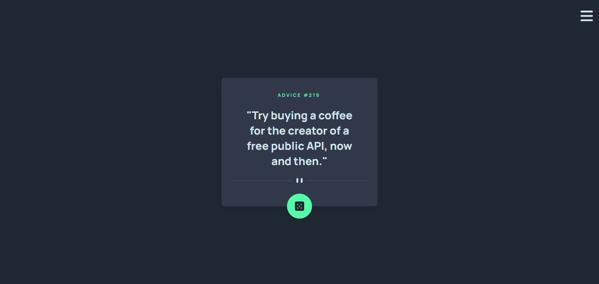
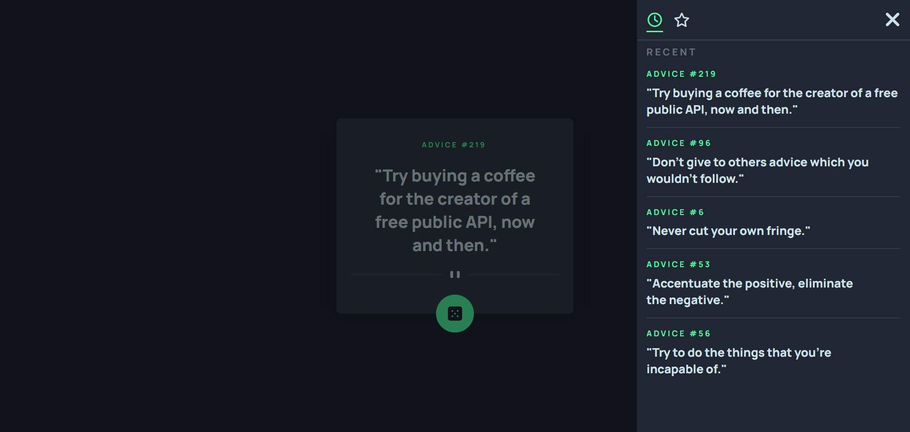

# Frontend Mentor - Advice generator app solution

This is a solution to the [Advice generator app challenge on Frontend Mentor](https://www.frontendmentor.io/challenges/advice-generator-app-QdUG-13db). Frontend Mentor challenges help you improve your coding skills by building realistic projects.

[](https://denislav-dimov.github.io/advice-generator-app/)

## Table of contents

- [Overview](#overview)
  - [The challenge](#the-challenge)
  - [Screenshot](#screenshot)
  - [Links](#links)
- [My process](#my-process)
  - [Built with](#built-with)
  - [What I learned](#what-i-learned)


## Overview

### The challenge

Users should be able to:

- View the optimal layout for the app depending on their device's screen size
- See hover states for all interactive elements on the page
- Generate a new piece of advice by clicking the dice icon
#### Bonus by me
- View the history of generated advices saved in local storage
- Add and view favourited advices saved in local storage

### Screenshot




### Links

- Solution URL: https://www.frontendmentor.io/solutions/just-a-solution-Nds8yxAM5n
- Live Site URL: https://denislav-dimov.github.io/advice-generator-app/

## My process

### Built with

- Semantic HTML5 markup
- CSS custom properties
- Flexbox
- CSS Grid
- Mobile-first workflow

### What I learned

I really wanted to try fetching data from an API so this project was great and I learned how to do so.

```js
async function getData() {
  try {
    const response = await fetch(API_URL);

    if (!response.ok) {
      throw new Error(`Response status: ${response.status}`);
    }

    return await response.json();

  } catch (error) {
    console.error(`Error when fetching: ${error.message}`);
  }
}
```
